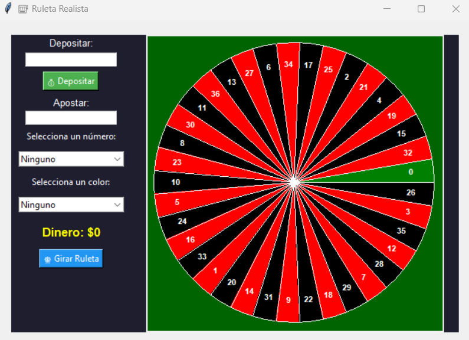

# Ruleta_juego

Este es un proyecto simple de una **ruleta animada** hecha con **Tkinter**, donde puedes **apostar dinero virtual** a un número o color (rojo, negro o verde). Ideal como práctica de interfaces gráficas, lógica de juego y animación en Python.


---

## 🧩 Funcionalidades

- ✅ Depositar dinero virtual  
- 🎯 Apostar a número, color o ambos  
- 🎡 Animación realista de ruleta  
- 🎨 Representación de colores reales de una ruleta (rojo, negro, verde)  
- 💬 Mensajes de victoria o pérdida  
- 🧠 Lógica de apuestas con multiplicadores (x35 para número, x2 para color)  

---

## 🚀 Requisitos

- Python 3.x  
- Tkinter (viene incluido con la mayoría de instalaciones de Python)

---

## 📦 Instalación y uso

1. Clona este repositorio:

```bash
git clone https://github.com/tu-usuario/ruleta-python.git
cd ruleta-python
Ejecuta el archivo principal:

bash
Copiar
Editar
python ruleta.py
📁 Estructura del Proyecto
bash
Copiar
Editar
ruleta-python/
├── ruleta.py           # Código principal de la ruleta
└── README.md           # Este archivo
Opcional: Puedes incluir una imagen captura.png si deseas mostrar una vista previa.

🤖 Lógica del juego
Se selecciona aleatoriamente un número del 0 al 36.

El número y su color son comparados con la apuesta del usuario.

Ganancias:

Si aciertas el número, ganas 35 veces tu apuesta.

Si aciertas solo el color, ganas 2 veces tu apuesta.

🧑‍💻 Autor
Juan David Jáuregui 
📧 jundav10jz@gmail.com
🐙 @JuanPyStar
